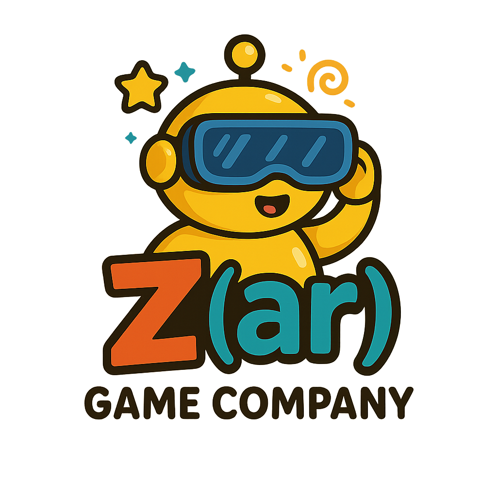

# Dünya Kaşifi: AR Tabanlı Eğitici Mobil Uygulama

<div align="center">
  
  <br><br>
  <p><strong>Eğlenceli Öğrenmeyle Dünyayı Keşfet</strong></p>
</div>

## 📱 Proje Tanıtımı

**Dünya Kaşifi**, **Zar Game Company** tarafından geliştirilen, çocukların uçuş esnasında farklı ülkeleri, kültürleri ve dilleri eğlenceli ve interaktif bir şekilde keşfetmelerini sağlayan artırılmış gerçeklik (AR) tabanlı bir mobil uygulamadır. Eğitim ve eğlenceyi birleştiren yapısıyla, çocukların global vatandaşlık bilincini geliştirmeyi hedefler.

Proje, zengin AR deneyimleri, mini oyunlar, dil öğrenimi aktiviteleri ve ödül mekanizmalarıyla donatılmıştır. Çocukların ilgi çekici bir şekilde dünya kültürlerini tanımasına, farklı dillerden kelimeler öğrenmesine ve eğlenerek keşfetmesine olanak tanır.

### 🌍 Uygulama Platformları

- **Android:** 6.0 ve üzeri
- **iOS:** 12.0 ve üzeri
- **Desteklenen AR Çerçeveleri:** ARCore, ARKit

## ⭐ Öne Çıkan Özellikler

### 📍 Artırılmış Gerçeklik Deneyimleri
- **3D İnteraktif Dünya Haritası:** Düz yüzeylerde görüntülenebilen, tıklanabilen dünya haritası
- **Kültürel Yapı Modelleri:** Eyfel Kulesi, Pisa Kulesi, Özgürlük Heykeli gibi ünlü yapıların 3D AR modelleri
- **Gerçek Zamanlı Etkileşim:** Fiziksel nesneleri tanıma ve dijital içerikle etkileşime geçme

### 🧩 Kişiselleştirme ve Karakter Sistemi
- **Avatar Oluşturma:** Kullanıcıya özel kaşif karakteri oluşturma
- **Ekipman Sistemi:** Sihirli Pusula, Dürbün, Tercüman Cihazı gibi çeşitli ekipmanlar
- **Kostüm Koleksiyonu:** Farklı kültürlere ait geleneksel kostümler

### 🎮 Eğitici Mini Oyunlar
- **Dil Öğrenimi:** Her ülkeye özgü kelime ve temel cümle öğrenimi
- **Kültür Aktiviteleri:** Yemek pişirme, geleneksel dans, müzik aletleri tanıma
- **Coğrafi Bilgiler:** Harita eşleştirme, bayrak tanıma, başkent bulma

### 🏆 İlerleme ve Motivasyon Sistemi
- **Kaşif Pasaportu:** Ziyaret edilen ülkelerin damga koleksiyonu
- **Rozet Sistemi:** Farklı başarılar için kazanılan rozetler
- **Seviye İlerlemesi:** Keşfedilen içerikle birlikte artan seviyeler

### 👨‍👩‍👧‍👦 Ebeveyn ve Güvenlik Özellikleri
- **Ebeveyn Kontrolü:** Oturum süresi sınırlaması, içerik filtreleme
- **Göz Sağlığı Koruması:** Düzenli mola hatırlatıcıları
- **Pozisyon Önerileri:** Doğru oturma ve cihaz tutma pozisyonu önerileri

## 🔧 Teknoloji Yığını

- **Oyun Motoru:** Unity 3D (2023.1 LTS)
- **AR Teknolojileri:** ARCore (Android), ARKit (iOS)
- **Backend:** Firebase (Authentication, Realtime Database, Storage)
- **3D Modelleme:** Blender, Maya
- **UI/UX Tasarım:** Figma, Adobe XD
- **Programlama Dilleri:** C#, JavaScript
- **CI/CD:** GitHub Actions

## 📂 Proje Yapısı

```
Dünya-Kaşifi-AR/
├── docs/                       # Dokümantasyon
│   ├── kurumsal/              # Kurumsal bilgiler
│   ├── tasarım-dokümanları/   # Tasarım dokümanları
│   ├── teknik-dokümanlar/     # Teknik dokümanlar
│   └── planlama/              # Planlama dokümanları
├── planning/                   # Proje yönetimi ve planlama
│   ├── backlog.md             # Ürün backlog'u
│   ├── user-story-örnekleri.md # Kullanıcı hikayeleri
│   └── sprint-plan.md         # Sprint planlaması
├── src/                        # Kaynak kodları
│   ├── Assets/                # Unity proje dosyaları
│   │   ├── Scripts/          # C# kodları
│   │   ├── Prefabs/          # Ön hazırlık objeleri
│   │   ├── Models/           # 3D modeller
│   │   └── Scenes/           # Oyun sahneleri
│   └── README.md              # Geliştirici rehberi
├── web/                        # Web sitesi dosyaları
│   ├── index.html             # Ana sayfa
│   ├── css/                   # Stil dosyaları
│   └── js/                    # JavaScript dosyaları
├── .github/workflows/          # CI/CD yapılandırmaları
└── README.md                   # Ana proje açıklaması
```

## 🏢 Kurumsal Bilgiler

<div align="center">
  
</div>

**Zar Game Company**, eğitici ve eğlenceli mobil oyunlar geliştiren, artırılmış gerçeklik (AR) teknolojilerini kullanarak çocuklara ve gençlere yönelik eğitici içerikler sunan bir oyun şirketidir.

- **Vizyon:** Eğitici oyunlar ve AR deneyimleriyle dünya çapında öğrenmeyi eğlenceyle birleştirerek, yeni nesil öğrenme platformlarında öncü olmak.
- **Misyon:** Çocukların merak duygusunu harekete geçiren, yaratıcılıklarını destekleyen ve öğrenme süreçlerini eğlenceli hale getiren, teknoloji odaklı eğitici içerikler geliştirmek.

Detaylı bilgi için: [Şirket Profili](docs/kurumsal/şirket-profili.md) | [Kurumsal Kimlik](docs/kurumsal/kurumsal-kimlik.md) | [İletişim Bilgileri](docs/kurumsal/iletişim-bilgileri.md)

## 👥 Ekip ve Katkıda Bulunanlar

| İsim | Rol | Sorumluluklar |
|------|-----|---------------|
| **Şahin Atakan Emre** | Kodlama ve Yapısal Tasarım | AR teknolojileri, kod mimarisi, teknik altyapı |
| **Züleyha Kezer** | Scrum Master ve Oyun Tasarımı | Proje yönetimi, eğitim içeriği, kullanıcı deneyimi |

## 🛠️ Kurulum ve Geliştirme

### Gereksinimler
- Unity 2023.1 LTS veya üzeri
- Android Studio / Xcode
- Git
- Node.js 18+ (web geliştirmesi için)

### Kurulum Adımları
1. Depoyu klonlayın: 
```bash
git clone https://github.com/Atakan-Emre/Zar-GameCompany.git
cd Dunya-Kasifi-AR
```

2. Unity projesini açın:
```bash
cd src
# Unity Hub üzerinden proje klasörünü açın
```

3. Web geliştirmesi için:
```bash
cd web
npm install
npm start
```

### Geliştirme İş Akışı
1. Güncel `main` branch'inden pull alın
2. Yeni bir özellik branch'i oluşturun: `feature/yeni-ozellik-adi`
3. Değişikliklerinizi yapın ve commit edin
4. Pull request oluşturun ve kod incelemesi talep edin

## 📊 Roadmap ve İlerleme

- [x] Konsept ve Proje Planı (Q1 2023)
- [x] Prototip Geliştirme (Q2 2023)
- [x] Alpha Sürümü (Q3 2023)
- [ ] Beta Testi (Q4 2023)
- [ ] İlk Resmi Sürüm (Q1 2024)
- [ ] Yeni Ülke Paketleri (Q2 2024)
- [ ] Multiplayer Özellikleri (Q3 2024)

## 📑 Lisans ve Telif Hakkı

© 2023-2025 Zar Game Company. Tüm hakları saklıdır.

Bu projenin kaynak kodu [LICENSE](LICENSE) dosyasında belirtilen şartlar altında lisanslanmıştır.

## 📞 İletişim

- **E-posta:** info@zargamecompany.com
- **Web Sitesi:** www.zargamecompany.com
- **LinkedIn:** [Zar Game Company](https://linkedin.com/company/zar-game-company)