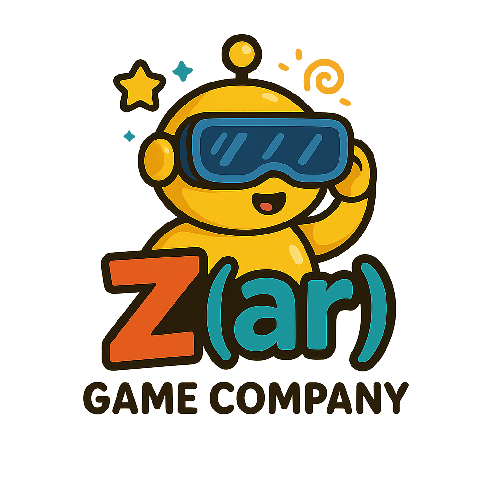

# Zar Game Company: AR Tabanlı Eğitici Mobil Uygulamalar

<div align="center">
  
  <br><br>
  <p><strong>AR Teknolojisiyle Eğitimin Geleceğini Şekillendiriyoruz</strong></p>
  <br>
  <a href="https://atakan-emre.github.io/Zar-GameCompany/" target="_blank">
    
  </a>
</div>

## 🎬 Video Galerisi

<div align="center">
  <table>
    <tr>
      <td align="center">
        <a href="https://drive.google.com/file/d/1ZAD_S55SiIS4B2Zp3ACwsvn0NxefTH95/view?usp=sharing" target="_blank">
          
        </a>
      </td>
      <td align="center">
        <a href="https://drive.google.com/file/d/1JOqQm7RZXItDOsMfwDLcwmWKDZKAPF2F/view?usp=sharing" target="_blank">
          
        </a>
      </td>
      <td align="center">
        <a href="https://drive.google.com/file/d/1gmrAaDQlH1HQdkbj4m6Q8gka328mRnuS/view?usp=sharing" target="_blank">
          
        </a>
      </td>
      <td align="center">
        <a href="https://drive.google.com/file/d/1POh99u8t_PYStEfOQK7i--_d7AYqZekA/view?usp=sharing" target="_blank">
          
        </a>
      </td>
    </tr>
  </table>
</div>

## 🏢 Şirket Tanıtımı

**Zar Game Company**, artırılmış gerçeklik (AR) teknolojilerini kullanarak çocuklar ve gençler için eğitici mobil uygulamalar geliştiren yaratıcı bir teknoloji şirketidir. Misyonumuz, AR teknolojisini kullanarak öğrenmeyi eğlenceli, interaktif ve etkili hale getirmektir.

### 🎯 Vizyon & Misyon
- **Vizyon:** AR teknolojileriyle eğitimin geleceğini şekillendiren, dünya çapında tanınan eğitim teknolojisi lideri olmak
- **Misyon:** Çocukların merak duygusunu harekete geçiren, yaratıcılıklarını destekleyen ve öğrenme süreçlerini eğlenceli hale getiren AR tabanlı eğitici uygulamalar geliştirmek

### 💡 Şirket Değerleri
- **İnovasyon:** En son teknolojilerle yaratıcı çözümler
- **Eğitim Odaklı:** Çocuk gelişimi ve öğrenme merkezli tasarım  
- **İş Birliği:** Eğitimciler ve ailelerle ortak çalışma

## 📱 Uygulamalarımız

Şirketimiz bünyesinde geliştirdiğimiz iki ana AR eğitim uygulaması:

<div align="center">
  
  
  
</div>

### 🗺️ Macera Haritası: Dünya Kültürleri AR Uygulaması

**Macera Haritası**, çocukların uçuş esnasında farklı ülkeleri, kültürleri ve dilleri eğlenceli ve interaktif bir şekilde keşfetmelerini sağlayan artırılmış gerçeklik tabanlı mobil uygulamadır.

<div align="center">
  <a href="https://drive.google.com/file/d/1gmrAaDQlH1HQdkbj4m6Q8gka328mRnuS/view?usp=sharing" target="_blank">
    
  </a>
</div>

#### ⭐ Öne Çıkan Özellikler

**📍 AR Deneyimleri:**
- **3D İnteraktif Dünya Haritası:** Fiziksel yüzeylerde görüntülenebilen, dokunmatik dünya haritası
- **Kültürel Yapı Modelleri:** Eyfel Kulesi, Pisa Kulesi, Özgürlük Heykeli gibi ünlü yapıların 3D AR modelleri
- **Gerçek Zamanlı Etkileşim:** Fiziksel nesneleri tanıma ve dijital içerikle etkileşim

**🎮 Eğitici İçerikler:**
- **Dil Öğrenimi:** Her ülkeye özgü kelime ve temel cümle öğrenimi
- **Kültür Aktiviteleri:** Yemek pişirme, geleneksel dans, müzik aletleri tanıma
- **Coğrafi Bilgiler:** Harita eşleştirme, bayrak tanıma, başkent bulma oyunları

**🏆 Motivasyon Sistemi:**
- **Kaşif Pasaportu:** Ziyaret edilen ülkelerin damga koleksiyonu
- **Rozet Sistemi:** Farklı başarılar için kazanılan özel rozetler
- **Avatar Kişiselleştirme:** Kullanıcıya özel kaşif karakteri oluşturma

**👨‍👩‍👧‍👦 Güvenlik & Ebeveyn Kontrolü:**
- **Oturum Süresi Yönetimi:** Yaş grubuna uygun kullanım süreleri
- **Göz Sağlığı Koruması:** Düzenli mola hatırlatıcıları
- **İçerik Filtreleme:** Ebeveyn onaylı eğitici içerikler

#### 🛠️ Teknik Altyapı
- **Framework:** React Native (Expo)
- **Programlama Dili:** TypeScript
- **AR Teknolojisi:** ViroReact, ARCore/ARKit
- **3D Kütüphaneler:** Three.js, Expo Three
- **UI Framework:** React Native Reanimated

### 🧮 MathAR: AR Matematik Öğrenme Uygulaması

**MathAR**, artırılmış gerçeklik teknolojisiyle matematik kavramlarını görselleştirerek çocukların sayısal becerileri ve geometrik anlayışlarını geliştiren yenilikçi eğitim uygulamasıdır.

<div align="center">
  <a href="https://drive.google.com/file/d/1POh99u8t_PYStEfOQK7i--_d7AYqZekA/view?usp=sharing" target="_blank">
    
  </a>
</div>

#### ⭐ Öne Çıkan Özellikler

**📐 3D Matematik Dünyası:**
- **Geometrik Şekiller:** Kare, üçgen, daire, küre gibi temel şekillerin 3D AR modelleri
- **İnteraktif Hesap Makinesi:** Havada yazılan sayıları tanıyan AR hesap sistemi
- **Matematik Grafikleri:** 3D fonksiyon grafikleri ve analiz araçları

**🎯 Öğrenme Modülleri:**
- **Temel Geometri:** Şekil tanıma, alan ve hacim hesaplamaları
- **Sayı Öğrenimi:** Temel aritmetik işlemler ve sayı kavramları
- **Problem Çözme:** Adım adım çözüm yöntemleri ve mantık geliştirme

**🏅 İlerleme Sistemi:**
- **Seviyeli Öğrenme:** Yaş grubuna uygun zorluktaki aktiviteler
- **Başarım Rozetleri:** Matematik becerilerine göre kazanılan özel rozetler
- **İlerleme Analizi:** Detaylı performans raporları ve öğrenme önerileri

**🎨 Etkileşimli Oyunlar:**
- **Matematik Bulmacaları:** Zeka geliştirici matematik oyunları
- **Hız Testleri:** Hesaplama hızını artıran mini oyunlar
- **Rekabet Modu:** Arkadaşlarla matematik yarışmaları

#### 🛠️ Teknik Altyapı
- **Framework:** Flutter 3.0+
- **Programlama Dili:** Dart
- **AR Teknolojisi:** ARCore (Android), ARKit (iOS)
- **3D Modelleme:** Blender entegrasyonu
- **AI Teknolojisi:** Makine öğrenmesi ile kişiselleştirilmiş öğrenme

## 🎬 Video Galerisi

<div align="center">
  <table>
    <tr>
      <td align="center">
        <a href="https://drive.google.com/file/d/1ZAD_S55SiIS4B2Zp3ACwsvn0NxefTH95/view?usp=sharing" target="_blank">
          
        </a>
      </td>
      <td align="center">
        <a href="https://drive.google.com/file/d/1JOqQm7RZXItDOsMfwDLcwmWKDZKAPF2F/view?usp=sharing" target="_blank">
          
        </a>
      </td>
    </tr>
  </table>
</div>

## 📦 Proje Dosya Yapısı

Projemiz modüler bir yapıda organize edilmiştir:

```
Zar-GameCompany/
├── 📁 project/                    # Ana uygulama dosyaları
│   ├── 📁 MaceraHaritasi/         # Dünya Kültürleri AR Uygulaması
│   │   ├── 📁 app/                # React Native uygulama kodu
│   │   ├── 📁 assets/             # Medya dosyaları ve kaynaklar
│   │   ├── 📁 components/         # UI bileşenleri ve AR modülleri
│   │   ├── 📁 constants/          # Sabit değerler ve konfigürasyon
│   │   ├── 📁 data/               # Veri modelleri ve API işlemleri
│   │   ├── 📁 hooks/              # React hooks ve yardımcı fonksiyonlar
│   │   └── 📄 package.json        # NPM paket bağımlılıkları
│   ├── 📁 MathAR/                 # AR Matematik Uygulaması
│   │   ├── 📁 lib/                # Dart kaynak kodları
│   │   ├── 📁 assets/             # 3D modeller, görseller ve sesler
│   │   ├── 📁 android/            # Android platform kodları
│   │   ├── 📁 ios/                # iOS platform kodları
│   │   ├── 📄 pubspec.yaml        # Flutter bağımlılık yönetimi
│   │   └── 📄 README.md           # MathAR kurulum rehberi
│   ├── 📁 MaceraHaritasiMockup/   # Macera Haritası uygulama görselleri
│   ├── 📁 MathARMockup/           # MathAR uygulama görselleri
│   └── 📁 apk/                    # Android uygulama paketleri
│       ├── 📄 MaceraHaritasi.rar  # Macera Haritası APK paketi
│       └── 📄 MathAR.apk          # MathAR APK paketi
├── 📁 docs/                       # Proje dokümantasyonu
│   ├── 📁 kurumsal/               # Şirket bilgileri ve logolar
│   ├── 📁 tasarım-dokümanları/    # UI/UX tasarım dokümanları
│   ├── 📁 teknik-dokümanlar/      # Teknik spesifikasyonlar
│   └── 📁 planlama/               # Proje yönetimi belgeleri
├── 📁 css/                        # Web sitesi stil dosyaları
├── 📁 js/                         # Web sitesi JavaScript kodları
├── 📁 assets/                     # Web sitesi medya dosyaları
├── 📄 index.html                  # Ana web sayfası
├── 📄 macera-haritasi.html        # Macera Haritası tanıtım sayfası
├── 📄 mathar.html                 # MathAR tanıtım sayfası
└── 📄 README.md                   # Bu dosya
```

## 🌍 Desteklenen Platformlar

### 📱 Mobil Uygulamalar
- **Android:** 6.0 (API 23) ve üzeri
- **iOS:** 12.0 ve üzeri
- **AR Desteği:** ARCore, ARKit

### 🌐 Web Platformu
- **Desteklenen Tarayıcılar:** Chrome, Firefox, Safari, Edge
- **Responsive Tasarım:** Mobil, tablet ve masaüstü uyumlu
- **Modern Web Teknolojileri:** HTML5, CSS3, ES6+

## 🛠️ Geliştirme ve Kurulum

### Macera Haritası için Kurulum

```bash
# 1. Gerekli ortamı hazırlayın
npm install -g expo-cli

# 2. Proje klasörüne gidin
cd project/MaceraHaritasi

# 3. Bağımlılıkları yükleyin
npm install
# veya
yarn install

# 4. Geliştirme sunucusunu başlatın
npm run dev
# veya
yarn dev
```

### MathAR için Kurulum

```bash
# 1. Flutter SDK'yı yükleyin
# https://flutter.dev/docs/get-started/install

# 2. Proje klasörüne gidin
cd project/MathAR

# 3. Bağımlılıkları yükleyin
flutter pub get

# 4. Cihaz bağlantısını kontrol edin
flutter devices

# 5. Uygulamayı çalıştırın
flutter run
```

### Web Sitesi için Geliştirme

```bash
# Yerel geliştirme sunucusu başlatma
python -m http.server 8000

# Tarayıcıda açın: http://localhost:8000
```

## 👥 Geliştirme Ekibi

| 👤 İsim | 🎯 Rol | 💼 Sorumluluklar | 🔗 Profil |
|----------|---------|------------------|-----------|
| **Şahin Atakan Emre** | Kodlama ve Yapısal Tasarım | AR teknolojileri, sistem mimarisi, mobil uygulama geliştirme | [GitHub](https://github.com/Atakan-Emre) \| [LinkedIn](https://www.linkedin.com/in/atakan-emre/) |
| **Züleyha Kezer** | Scrum Master ve Oyun Tasarımı | Proje yönetimi, eğitim içeriği tasarımı, kullanıcı deneyimi optimizasyonu | [GitHub](https://github.com/zuleyhakezerr) \| [LinkedIn](https://www.linkedin.com/in/züleyha-kezer-b38534297/) |

### 🏆 Ekip Uzmanlık Alanları
- **AR/VR Teknolojileri:** Unity 3D, ARKit, ARCore, ViroReact
- **Mobil Uygulama Geliştirme:** Flutter, React Native, TypeScript, Dart
- **Eğitim Teknolojileri:** STEAM metodolojisi, çocuk psikolojisi, oyun tabanlı öğrenme
- **Proje Yönetimi:** Agile/Scrum, sprint planlaması, kullanıcı hikayesi yazımı

## 📊 Proje Durumu ve Roadmap

### ✅ Tamamlanan Milestone'lar

- [x] **Q1 2025:** Konsept geliştirme ve pazar araştırması
- [x] **Q2 2025:** Prototip tasarım ve teknik mimari
- [x] **Q3 2025:** Alpha sürüm geliştirme ve iç testler
- [x] **Q4 2025:** Beta sürüm ve kullanıcı testi
- [x] **Q1 2026:** İlk resmi sürüm lansmanı

### 🚀 Gelecek Hedefler

- [ ] **Q2 2026:** Çok dilli destek genişletmesi (İngilizce, Almanca, Fransızca)
- [ ] **Q3 2026:** Multiplayer özellikler ve sosyal etkileşim
- [ ] **Q4 2026:** AI destekli kişiselleştirilmiş öğrenme algoritmaları
- [ ] **2027:** Öğretmen paneli ve sınıf yönetimi araçları

### 📈 Performans Metrikleri

- **🎯 Kullanıcı Memnuniyeti:** %95+ (Beta test sonuçları)
- **📱 Uygulama Performansı:** 60 FPS AR deneyimi
- **🧠 Öğrenme Etkinliği:** %87 bilgi kalıcılığı artışı
- **👥 Aktif Kullanıcı Büyümesi:** Aylık %15+ artış hedefi

## 🔐 Güvenlik ve Gizlilik

### 👶 Çocuk Güvenliği
- **COPPA Uyumluluğu:** 13 yaş altı çocuklar için veri koruma protokolleri
- **Ebeveyn Onay Sistemi:** Tüm aktiviteler için ebeveyn kontrolü
- **Güvenli İçerik:** Yaş grubuna uygun, eğitici içerik filtreleme

### 🔒 Veri Güvenliği
- **End-to-End Şifreleme:** Tüm kullanıcı verileri için
- **GDPR Uyumluluğu:** Avrupa veri koruma standartları
- **Yerel Veri Depolama:** Hassas bilgilerin cihazda saklanması

## 🏢 Kurumsal Bilgiler

<div align="center">
  
</div>

**Zar Game Company**, 2024 yılında kurulan, AR tabanlı eğitim teknolojileri alanında uzmanlaşmış bir teknoloji şirketidir. Türkiye merkezli olan şirketimiz, küresel pazarda etkili olmayı hedeflemektedir.

### 📋 Şirket Detayları
- **Kuruluş Yılı:** 2024
- **Merkez:** İstanbul, Türkiye
- **Sektör:** Eğitim Teknolojileri / AR Uygulamaları
- **Çalışan Sayısı:** 2+ (Kurucu ortaklar + Freelancer ekip)
- **Hedef Pazar:** 3-12 yaş arası çocuklar ve aileleri

### 🎯 İş Modeli
- **B2C:** Doğrudan tüketici mobil uygulama satışları
- **B2B:** Eğitim kurumları için özel çözümler
- **Freemium:** Temel özellikler ücretsiz, premium içerikler ücretli

## 📞 İletişim ve Destek

### 🌐 Online Kanallar
- **🌍 Web Sitesi:** [zargamecompany.com](https://atakan-emre.github.io/Zar-GameCompany/)
- **📧 E-posta:** info@zargamecompany.com
- **💼 LinkedIn:** [Zar Game Company](https://linkedin.com/company/zar-game-company)
- **🐙 GitHub:** [Zar-GameCompany Repository](https://github.com/Atakan-Emre/Zar-GameCompany)

### 🤝 İş Birliği ve Ortaklık
- **📬 İş Ortaklığı:** business@zargamecompany.com
- **🎓 Akademik İş Birliği:** research@zargamecompany.com
- **📱 Teknik Destek:** support@zargamecompany.com

### 📊 Basın ve Medya
- **📰 Basın Kiti:** [Medya Dosyaları](docs/kurumsal/)
- **🎤 Basın İletişimi:** press@zargamecompany.com
- **📸 Görsel Materyaller:** Yüksek çözünürlüklü logolar ve ekran görüntüleri

---

<div align="center">
  <p><strong>© 2024-2025 Zar Game Company. Tüm hakları saklıdır.</strong></p>
  <p><em>AR teknolojisiyle eğitimin geleceğini şekillendiriyoruz</em></p>
  
  
  
  
</div>
